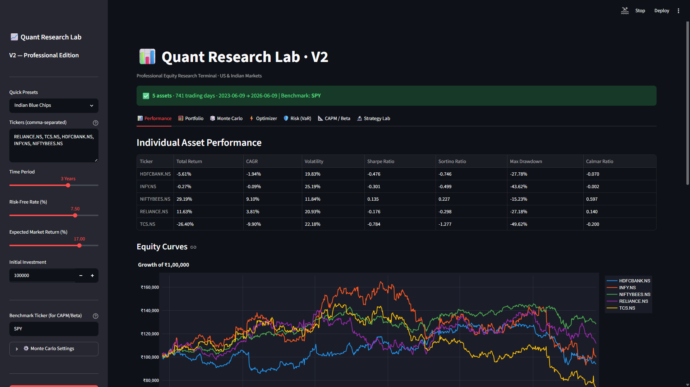

# 📊 Quant Research Lab

A modular quantitative finance and portfolio research platform built in Python for exploring **equity markets, portfolio optimization, risk analytics, and systematic trading strategies** across both **US and Indian markets**.

The project started as a performance analytics dashboard and has evolved into a comprehensive research environment implementing concepts from **Modern Portfolio Theory (MPT), Capital Asset Pricing Model (CAPM), Risk Management, and Strategy Backtesting**.

---

## 🎯 Project Vision

The goal of Quant Research Lab is to learn and apply real-world concepts used by:

* Quantitative Researchers
* Portfolio Managers
* Risk Analysts
* Data Scientists
* Algorithmic Traders

while building a professional-grade finance project from scratch.

This project combines:

* Financial Analytics
* Portfolio Theory
* Risk Management
* Strategy Research
* Data Visualization
* Software Engineering

into a single interactive platform.

---

# 🚀 Project Evolution

## V1 — Core Analytics Platform

The first version focused on building a strong foundation for equity and portfolio analysis.

### Features

✅ Market Data Engine (Yahoo Finance)

✅ US & Indian Market Support

✅ Performance Analytics

* Total Return
* CAGR
* Cumulative Returns
* Equity Curve

✅ Risk Analytics

* Volatility
* Sharpe Ratio
* Sortino Ratio
* Maximum Drawdown
* Calmar Ratio

✅ Portfolio Simulator

* Custom Portfolio Weights
* Portfolio Returns
* Portfolio Risk
* Correlation Analysis

✅ Strategy Backtesting

* Buy & Hold
* SMA Crossover

✅ Interactive Streamlit Dashboard

---

## V2 — Quantitative Research Upgrade

Version 2 expands the platform into a more advanced quantitative research environment.

### Portfolio Research

✅ Monte Carlo Portfolio Simulation

* Thousands of randomly generated portfolios
* Risk vs Return analysis
* Diversification exploration

✅ Efficient Frontier

* Modern Portfolio Theory
* Risk-return optimization

✅ Portfolio Optimizer

* Maximum Sharpe Portfolio
* Minimum Variance Portfolio
* Constrained Optimization using SciPy

---

### Risk Management

✅ Value at Risk (VaR)

* Historical VaR
* Parametric VaR

✅ Conditional Value at Risk (CVaR)

* Tail Risk Analysis
* Expected Shortfall

---

### Asset Pricing Models

✅ CAPM Analytics

* Beta
* Alpha
* R²
* Expected Return
* Security Market Line (SML)

---

### Strategy Research

Additional systematic trading strategies:

✅ EMA Crossover

✅ RSI Mean Reversion

✅ MACD Strategy

Strategy comparison framework:

* Returns
* Sharpe Ratio
* Drawdown
* Risk Metrics

---

### Advanced Visualizations

✅ Efficient Frontier Charts

✅ Monte Carlo Portfolio Cloud

✅ Security Market Line

✅ Risk Distribution Analysis

✅ Strategy Comparison Visualizations

---

# 📂 Project Structure

```text
quant-research-lab/
│
├── src/
│   │
│   ├── analytics/
│   │   ├── returns.py
│   │   ├── risk.py
│   │   ├── var.py
│   │   └── capm.py
│   │
│   ├── data/
│   │   └── data_loader.py
│   │
│   ├── portfolio/
│   │   ├── portfolio_engine.py
│   │   ├── monte_carlo.py
│   │   └── optimizer.py
│   │
│   ├── strategies/
│   │   ├── buy_hold.py
│   │   ├── sma_crossover.py
│   │   ├── ema_strategy.py
│   │   ├── rsi_strategy.py
│   │   └── macd_strategy.py
│   │
│   ├── visualization/
│   │   ├── charts.py
│   │   └── frontier_charts.py
│   │
│   └── dashboard/
│       └── app.py
│
├── requirements.txt
└── README.md
```

---

# 📚 Quantitative Finance Concepts Implemented

## Performance Analytics

* Total Return
* CAGR
* Rolling Returns
* Equity Curves

## Risk Analytics

* Volatility
* Sharpe Ratio
* Sortino Ratio
* Maximum Drawdown
* Calmar Ratio
* Value at Risk (VaR)
* Conditional VaR (CVaR)

## Portfolio Theory

* Diversification
* Correlation Analysis
* Portfolio Variance
* Monte Carlo Simulation
* Efficient Frontier
* Maximum Sharpe Portfolio
* Minimum Variance Portfolio

## Asset Pricing

* CAPM
* Beta
* Alpha
* Expected Return
* Security Market Line

## Strategy Research

* Buy & Hold
* SMA Crossover
* EMA Crossover
* RSI Mean Reversion
* MACD

---

# 📊 Dashboard Modules

| Module          | Description                                     |
| --------------- | ----------------------------------------------- |
| 📊 Performance  | Returns and risk-adjusted performance metrics   |
| 🧮 Portfolio    | Portfolio construction and correlation analysis |
| 🎲 Monte Carlo  | Random portfolio simulation and visualization   |
| ⚡ Optimizer     | Maximum Sharpe and Minimum Variance portfolios  |
| 🛡️ VaR         | Risk management and tail-risk analytics         |
| 📐 CAPM         | Beta, Alpha and expected return estimation      |
| 🔬 Strategy Lab | Strategy backtesting and comparison             |

---

# 🛠️ Technology Stack

### Programming

* Python

### Data Analysis

* Pandas
* NumPy

### Quantitative Finance

* SciPy

### Data Source

* Yahoo Finance (yfinance)

### Visualization

* Plotly

### Dashboard

* Streamlit

### Version Control

* Git
* GitHub

---

# ⚙️ Installation

## Clone Repository

```bash
git clone https://github.com/rudytheacecoder18/Quant-Research-Lab.git
cd Quant-Research-Lab
```

## Create Virtual Environment

```bash
python -m venv venv
```

### Windows

```bash
venv\Scripts\activate
```

### Linux / Mac

```bash
source venv/bin/activate
```

## Install Dependencies

```bash
pip install -r requirements.txt
```

## Launch Dashboard

```bash
streamlit run src/dashboard/app.py
```

---

# 📸 Screenshots

Add screenshots here after running the dashboard:

* Performance Dashboard
* Portfolio Analytics
* Monte Carlo Simulation
* Efficient Frontier
* CAPM Analysis
* Strategy Lab

Example:

```markdown

```

---

# 🔮 Future Roadmap

## V3

* Walk Forward Testing
* Strategy Parameter Optimization
* Automated PDF Research Reports
* Portfolio Rebalancing Engine
* Advanced Performance Attribution

## V4

* Factor Investing Models
* Fama-French Factors
* Market Regime Detection
* Sector Rotation Research
* Machine Learning Alpha Signals

---

# 🎓 Learning Outcomes

This project demonstrates practical understanding of:

* Quantitative Finance
* Portfolio Management
* Risk Analytics
* Capital Market Theory
* Backtesting Frameworks
* Data Science
* Python Software Development

---

# 👨‍💻 Author

**Rudraksh Mehta**

GitHub: https://github.com/rudytheacecoder18

---

*"Building quantitative research tools to better understand markets, risk, and investment decision-making."*
